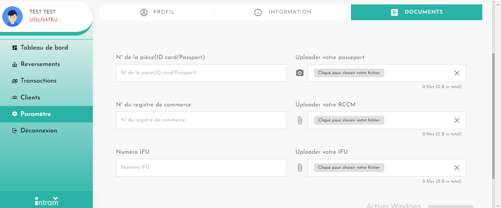

# Activation du compte marchand

L'activation transforme votre compte utilisateur en **compte marchand validé**, condition indispensable pour utiliser les clés `LIVE` et encaisser de vrais paiements. Vos clés `SANDBOX` fonctionnent dès l'inscription, sans validation.

## Étape 1 — Accéder aux paramètres

Connectez-vous puis allez dans **Paramètres** de votre compte utilisateur. Vous y verrez le menu permettant de valider votre premier compte business.

## Étape 2 — Renseigner les informations business

Cliquez sur **`INFORMATION`** pour accéder à la page des détails de votre compte business. Remplissez chaque champ demandé (raison sociale, type d'activité, adresse, contact…). Ces informations sont nécessaires pour la première partie de la validation.

## Étape 3 — Téléverser les documents

Insérez les documents demandés pour finaliser la validation de votre compte business (pièce d'identité, registre de commerce, justificatifs selon votre statut).


Suivez attentivement les recommandations affichées (formats acceptés, lisibilité, taille maximale) — un document non conforme entraîne un refus et oblige à recommencer la procédure.


## Étape 4 — Attendre la validation

Notre équipe vérifie vos documents sous **1 à 3 jours ouvrés** :

* **Validé** : vous recevez un email de confirmation et pouvez utiliser vos clés `LIVE` immédiatement.
* **Refusé** : vous recevez un email expliquant ce qui doit être corrigé. Vous pouvez resoumettre les documents directement depuis le dashboard.

## Pendant la validation

Vous pouvez intégralement développer votre intégration en attendant :

* Utilisez les clés `SANDBOX` (Menu **Développeurs → API → mode SANDBOX**).
* Toutes les fonctionnalités sont disponibles en sandbox sans restriction.
* Aucune somme réelle n'est manipulée — les wallets sandbox sont isolés.

## Voir aussi

* [Inscription](register.md) — créer le compte utilisateur initial
* [Récupérer vos clés API](../README.md#récupérer-vos-clés-api)
* [Devises et moyens de paiement supportés](../payment/supported-devices.md)
