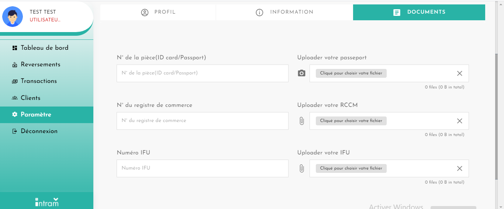

# Activation du compte machand

Accédez aux paramètres de votre compte utilisateur pour avoir accès au menu de validation de votre premier compte business.

Cliquez sur **`INFORMATION`** pour accéder à la page des détails de votre compte business. Vous devez remplir les informations demandées pour valider la première partie de la validation de votre compte business.

Insérez les documents demandés pour valider votre compte business.&#x20;


Il est important de suivre les recommandations émises pour éviter un refus de vos documents.&#x20;

